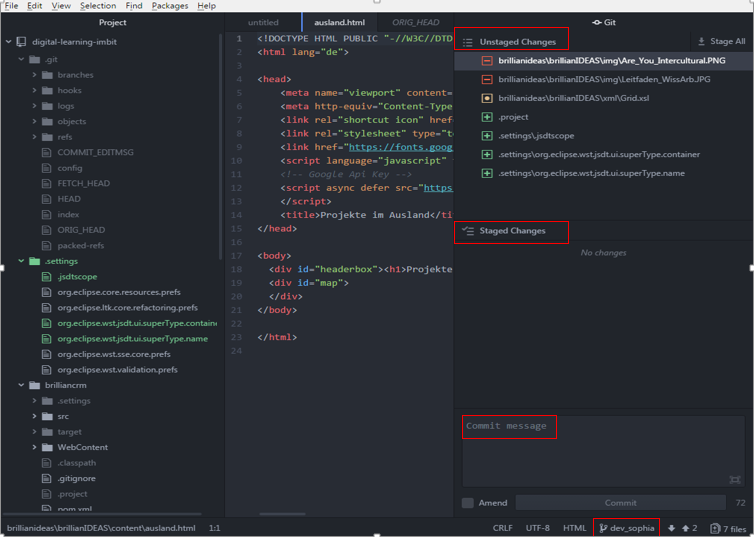
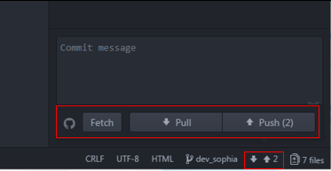
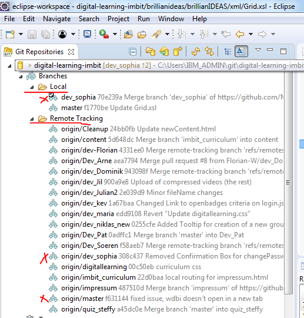
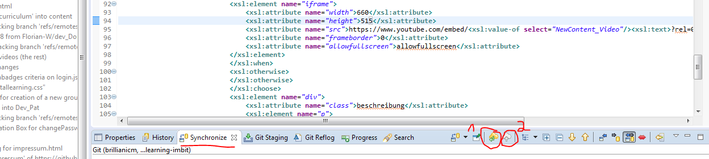
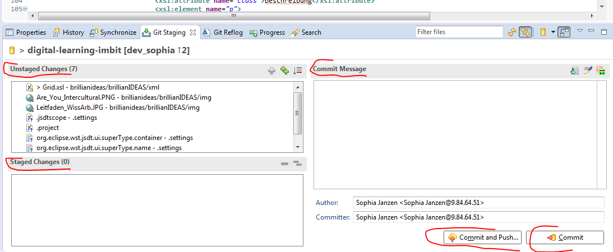
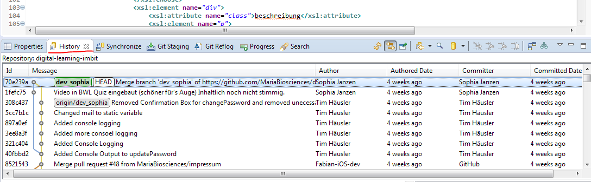

# Wissenstransfer Git: Pull, Push, Merge, Commit, Fetch…
Git ist eine Software zur Versionsverwaltung, welches das Zusammenarbeiten verschiedener Entwickler an einem Softwareprojekt erleichtern kann.  
Das Basis Konzept von Git ist grundsätzlich immer das gleiche, allerdings kann Git auf verschiedene Arten angesprochen werden. In unserem Kurs wurde Git hauptsächlich über
*	Git BASH
* Atom
* Eclipse
bedient. Genaue Erklärungen, wie Git über die einzelnen Tools zu bedienen ist, kann in xxx nachgelesen werden. 
## Allgemeines Vorgehen bei Git 
– alle Schritte ab 3. wiederholen sich bei jeder Änderung. Diese Schritte und Begrifflichkeiten sind bei jedem Tool gleich.
1.	Klone das remote Repository (um alle Daten in deiner Entwicklungsumgebung zu haben)
2.	Mache dir deine eigene Branch (oder eine Branch pro Team)
* Branches werden benutzt, um verschiedene Funktionen isoliert voneinander zu entwickeln. Der master-Branch ist der "Standard"-Branch, wenn du ein neues Repository erstellst. Du solltest aber für die Entwicklung andere Branches verwenden und diese dann in den Master-Branch zusammenführen (mergen).
3.	Nun arbeitest du auf deinem eigenen Workspace auf deinem PC. 
4.	Wichtig: Fetch oder Pull = synchronisieren deines local repositories 
* Fetch: lädt nur neue Daten aus dem Remote-Repository - aber es integriert keine dieser neuen Daten in deine Arbeitsdateien. Fetch ist ideal, um einen neuen Überblick über alle Vorgänge in einem Remote-Repository zu erhalten. Sicher ist, dass fetch niemals manipuliert oder zerstört  nicht oft genug machbar
* Pull: läd nicht nur neue Daten herunter; Es integriert sie auch direkt in deine aktuellen Arbeitskopie-Dateien. Dies hat einige Konsequenzen:
  * Da ein „pull“ versucht, remote Änderungen mit deinen lokalen zu verbinden, könne "Merge-Konflikte" auftreten. 
  * Bevor du „pullst“, solltest du alle Änderungen, die du behalten willst, committen. 
5.	Wenn du die aktuellste Version in deinem Local Repo hast, kannst du Änderungen vornehmen
6.	Diese musst du in die Staging Area ziehen, wenn du sie „veröffentlichen“ willst. Du kannst auswählen, ob du alle oder nur einzelne Änderungen „stagen“ willst.
7.	Wenn du nun „commitest“ werden alle Änderungen, die in deiner Staging Area sind in dein Local Repository geladen (nur auf deinem PC sichtbar) Denke daran immer eine Commit-Message zu formulieren.
8.	„Push“ um lokale Änderungen auf das remote Repo zu bekommen (hier können es andere Nutzer sehen) 
9.	„Merge“ deine Branch mit dem Master zu vereinen. Hier solltest du sicher sein, dass alles funktioniert


## Git BASH
Die wichtigsten Befehle:
1.	Neues Repository erstellen: 
```
git init
```
2.	Ein Repository auschecken:

```
git clone /pfad/zum/repository
```

```
git clone benutzername@host:/pfad/zum/repository
```
3.	Änderung in Stage Area schieben:
```
Git add <dateiname>
```
```
git add *
```
4.	Lokale Änderung mit Commit & Nachricht bestätigen
```
git commit -m "Commit-Nachricht"
```
5.	Änderungen zum remote Repository hochladen/ Master kann auch durch anderen Branch ersetzt werden.
```
git push origin master
```
6.	Neuen Branch erstellen:
``` git checkout -b <branchname> ```
7.	Um zum Master/ anderer Branch zurück zu wechseln
```
git checkout master
```
Und um den eben erstellten Branch wieder zu löschen:
```
git branch -d <branchname>
```
* Ein Branch ist nicht für andere verfügbar, bis du diesen in dein remote Repository hochlädst:
```
git push origin <branchname>
```
8.	Um dein lokales Repository mit den neuesten Änderungen zu aktualisieren, verwende:
```
git pull
```
in deiner Arbeitskopie, um die Änderungen erst herunterzuladen (fetch) und dann mit deinem Stand zusammenzuführen (merge).
Wenn du einen anderen Branch mit deinem aktuellen (z.B. master) zusammenführen willst, benutze:
```
git merge <branch>
```
In beiden Fällen versucht git die Änderungen automatisch zusammenzuführen. Unglücklicherweise ist dies nicht immer möglich und endet in Konflikten. Du bist verantwortlich, diese Konflikte durch manuelles Editieren der betroffenen Dateien zu lösen. Bist du damit fertig, musst du das git mit folgendem Befehl mitteilen:
```
git add <dateiname>
```
9.	Differenzen von Branches anzeigen
```
git diff <quell_branch> <ziel_branch>
```
10.	Änderungen rückgängig machen
•	Lokale Änderungen, die noch nicht zu staging area hinzugefügt wurden rückgängig machen
```
git checkout -- <filename>
```
•	Lokalen Änderungen komplett entfernen, holst du dir den letzten Stand vom entfernten Repository mit folgenden Befehlen:
```
git fetch origin
git reset --hard origin/master
```

## Atom
1.	Git Repo importieren
Command Palette > Git Clone: Clone



 
## Eclipse
Wie genau ein Git Repo in Eclipse eingebunden wird, kann in dem Dokument „Install Java, Eclipse and import Github Repository in Eclipse“ nachgelesen werden.
1.	Git Rep in Eclipse importieren
2.	Eigenen Branch erstellen: Hierfür auf den remote git master mit rechtsklick einen Branch createn.
3.	Um Branch zu wechseln: Doppelklick auf den Branch, der gewählt werden will



4.	Auf dem Tab Synchronize ist bei 1 Pull und bei 2 Push zu finden


 
5.	Auf dem Tab Git Staging, kannst du gewünschte Änderungen in die Staging Area ziehen, eine Commit Message erstellen und  Commiten und oder Pushen
 

6.	Auf dem Tab History ist der Commit Tree ganz anschaulich dargestellt. Hier kann man seinen eigenen Branch und den Master Branch beobachten und sehen, wann welche commits und merges durchgeführt wurden.

 
7.	Ein merge ist über rechtsklick auf dem eigenen Branch möglich


